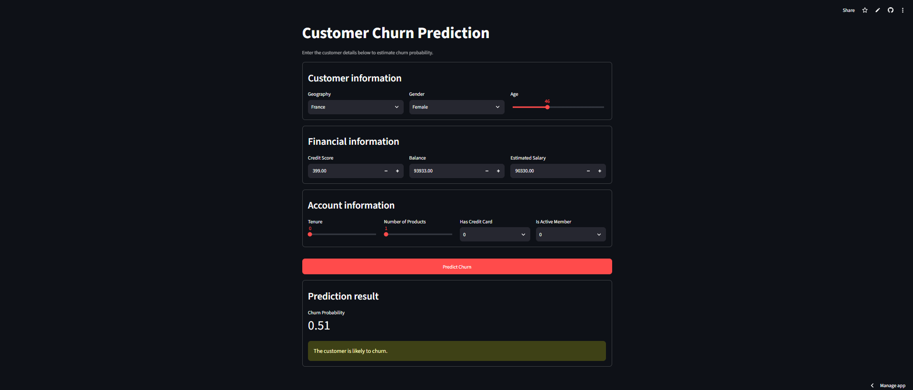

# Customer Churn Prediction using ANN


A deep learning mini project that predicts whether a bank customer is likely to **leave (churn)** or **stay**, using an Artificial Neural Network (ANN). The trained model is deployed as a web app using Streamlit.

---

## Live Demo

https://deep-learning-mini-projects-g9nlwzoj4hjp8phdkwgd7x.streamlit.app/

---

## Project Screenshot



---

## How It Works

1. User enters customer details (geography, gender, age, credit score, balance, salary, tenure, products, credit card, active member)
2. Inputs are encoded and scaled using the saved encoders and scaler
3. The ANN model outputs a **churn probability** between 0 and 1
4. If probability is greater than 0.5, the customer is **likely to churn**, otherwise **not likely to churn**

---

## Dataset

- **Churn Modelling dataset**, 10,000 customers and 14 columns
- Target column: `Exited` (1 = customer left, 0 = customer stayed)
- Dropped columns: `RowNumber`, `CustomerId`, `Surname`

---

## Model Details

| Part | Details |
|------|---------|
| Type | ANN (Sequential) |
| Hidden Layer 1 | 64 neurons, ReLU |
| Hidden Layer 2 | 32 neurons, ReLU |
| Output Layer | 1 neuron, Sigmoid |
| Optimizer | Adam (learning rate 0.01) |
| Loss | Binary Crossentropy |
| Callbacks | EarlyStopping, TensorBoard |

**Preprocessing:** Gender (Label Encoding), Geography (One-Hot Encoding), all features (StandardScaler)

---

## Tech Stack

- Python
- TensorFlow / Keras
- Scikit-learn
- Pandas, NumPy
- Streamlit

---

## Project Structure

```
├── app.py                    # Streamlit web app
├── experiments.ipynb         # Data preprocessing + model training
├── prediction.ipynb          # Testing the saved model on sample input
├── model.h5                  # Trained ANN model
├── scaler.pkl                # Saved StandardScaler
├── label_encoder_gender.pkl  # Saved Label Encoder (Gender)
├── onehot_encoder_geo.pkl    # Saved One-Hot Encoder (Geography)
├── Churn_Modelling.csv       # Dataset
├── project_screenshot.png    # App screenshot
└── requirements.txt          # Dependencies
```

---

## Run Locally

```bash
# 1. Clone the repository
git clone https://github.com/ShivanshMaurya001/Deep-Learning-Mini-Projects.git
cd Deep-Learning-Mini-Projects/ANN-Predictive-Modeling

# 2. Install requirements
pip install -r requirements.txt

# 3. Run the app
streamlit run app.py
```

---

## Author

**Shivansh Maurya**
GitHub: [@ShivanshMaurya001](https://github.com/ShivanshMaurya001)
