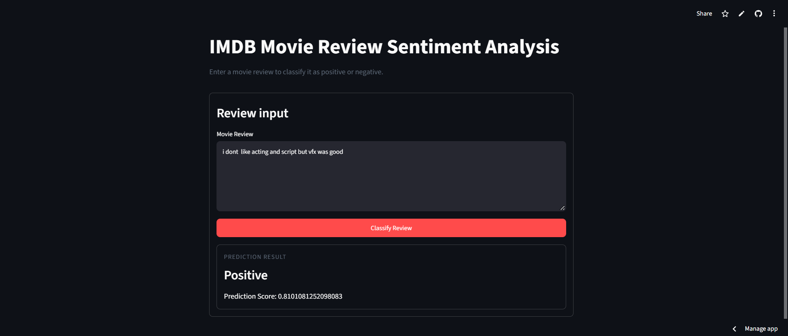

# IMDB Movie Review Sentiment Analysis using Simple RNN


A deep learning mini project that classifies a movie review as **Positive** or **Negative** using a Simple RNN (Recurrent Neural Network). The trained model is deployed as a web app using Streamlit.

---

## Live Demo

https://deep-learning-mini-projects-2tsevtpofzqw2smb2qx9xn.streamlit.app/

---

## Project Screenshot



---

## How It Works

1. User types or pastes a movie review
2. Text is converted to numbers using the IMDB word index and padded to 500 words
3. The RNN model outputs a **prediction score** between 0 and 1
4. If score is greater than 0.5, the review is **Positive**, otherwise **Negative**

---

## Dataset

- **IMDB Movie Reviews dataset** (from Keras), 50,000 reviews (25,000 train and 25,000 test)
- Labels: Positive (1) and Negative (0)
- Vocabulary size: 10,000 most frequent words
- Max review length: 500 (shorter reviews are padded)

---

## Model Details

| Part | Details |
|------|---------|
| Type | Simple RNN (Sequential) |
| Embedding Layer | 10,000 words to 128 dimensions |
| SimpleRNN Layer | 128 units, ReLU |
| Output Layer | 1 neuron, Sigmoid |
| Optimizer | Adam |
| Loss | Binary Crossentropy |
| Training | Batch size 32, up to 10 epochs, 20% validation split |
| Callback | EarlyStopping (monitor val_loss, patience 5) |
| Total Parameters | 1,313,025 |

Validation accuracy is around 80%.

---

## Tech Stack

- Python
- TensorFlow / Keras
- NumPy
- Streamlit

---

## Project Structure

```
├── main.py                   # Streamlit web app
├── embedding.ipynb           # Word embedding practice notebook
├── simplernn.ipynb           # Model training notebook
├── prediction.ipynb          # Testing the saved model on sample reviews
├── simple_rnn_imdb.h5        # Trained Simple RNN model
├── rnn_app_screenshot.png    # App screenshot
└── requirements.txt          # Dependencies
```

---

## Run Locally

```bash
# 1. Clone the repository
git clone https://github.com/ShivanshMaurya001/Deep-Learning-Mini-Projects.git
cd Deep-Learning-Mini-Projects/RNN-IMDB-Movie-Review

# 2. Install requirements
pip install -r requirements.txt

# 3. Run the app
streamlit run main.py
```

---

## Links

- 💻 [GitHub Repository](https://github.com/ShivanshMaurya001/Deep-Learning-Mini-Projects/tree/main/RNN-IMDB-Movie-Review)
- 🌐 [Live App](https://deep-learning-mini-projects-2tsevtpofzqw2smb2qx9xn.streamlit.app/)

---

## Author

**Shivansh Maurya**
GitHub: [@ShivanshMaurya001](https://github.com/ShivanshMaurya001)
